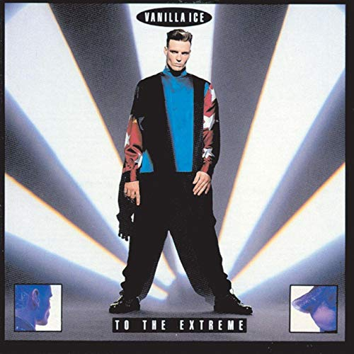

# Plain Vanilla JavaScript Baby

Proof of concept app using vanilla JavaScript.

## ❄️ Status: 👷‍♀️ Development

 

## ❄️ Installation

1. `git clone <this_url> && cd <repo_name>`
1. `npm install` (node)
1. `npm install lite-server --save-dev` (small dev-only server)

Additionally, if you wish to run the Jest tests, you will require Jest libs and @babel/preset-env (for testing ES6 modules)...

1. `npm install jest --save-dev`
1. `npm install jest-extended --save-dev`
1. `npm install @babel/preset-env`

## ❄️ Run

`npm run dev` will launch app on `http://localhost:3000`

## ❄️ Test

`npm test`

## ❄️ Dependencies

* Node.js 13.5.0

## ❄️ Dev dependencies
* lite-server 2.5.4
* @babel/preset-env 7.7.7
* jest 24.9.0
* jest-extended 0.11.2

## ❄️ Goals
* modern JavaScript features, style and convention
* minimise use of global namespace
* prefer arrow functions
* caching policy
* JSDoc implementation comments
* use client storage api
* [IndexedDB API](https://developer.mozilla.org/en-US/docs/Web/API/IndexedDB_API)

## ❄️ Features:

1. Display Github profile details and avatar from [https://api.github.com/users/v3](https://api.github.com/users/v3).
2. Cache data.

## ❄️ ES6
* Promises
* Async/Await
* ESM import/export

## ❄️ Design patterns
* Revealing Module Pattern RMP
* Constructor Function

## ❄️ Test 
* local storage mocking
* exported functions and classes

## ❄️ Browser apis

* [Document Object Model (DOM)](https://developer.mozilla.org/en-US/docs/Web/API/Document_Object_Model)
* [XMLHttpRequest](https://developer.mozilla.org/en-US/docs/Web/API/XMLHttpRequest)
* [Canvas](https://developer.mozilla.org/en-US/docs/Web/API/Canvas_API)
* [Web Storage](https://developer.mozilla.org/en-US/docs/Web/API/Web_Storage_API) - [Window.localStorage](https://developer.mozilla.org/en-US/docs/Web/API/Window/localStorage)

## ❄️ Style guide

Working toward [Google JavaScript Style Guide](https://google.github.io/styleguide/jsguide.html#introduction)

 

### 🍦 about localStorage

justification:
* sinlge-page app
* data is publicly available
* data size does not exceed 1.2MB

*Ice ice baby, Ice ice baby, All right stop, Collaborate and listen, Ice is back with my brand new invention, Something grabs a hold of me tightly, Flow like a harpoon daily and nightly, Will it ever stop?, Yo, I don't know, Turn off the lights and I'll glow, To the extreme, I rock a mic like a vandal, Light up a stage and wax a chump like a candle*

**Dance**

