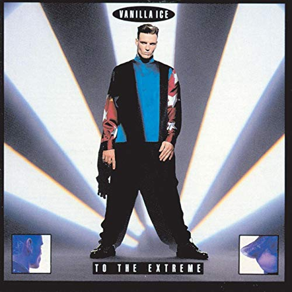

# Plain Vanilla JavaScript Baby

## Now
* Modular
* XMLHttpRequest
* DOMException.NetworkError
* DOMException.TimeoutError
* Caching/Local Storage - user data and image
* Async/Await
* Promise.then
* Dynamic DOM mods
* Network status - window.navigator.onLine
* Template strings

## TODO:

* Jest
* Namespacing
* makeItPretty
* prepare nodes from fetch error

*Ice ice baby, Ice ice baby, All right stop, Collaborate and listen, Ice is back with my brand new invention, Something grabs a hold of me tightly, Flow like a harpoon daily and nightly, Will it ever stop?, Yo, I don't know, Turn off the lights and I'll glow, To the extreme, I rock a mic like a vandal, Light up a stage and wax a chump like a candle*

**Dance**

